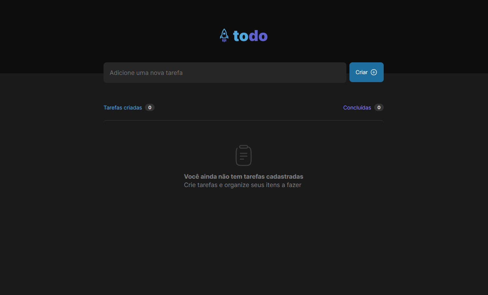

<div align="center" id="top"> 
  

  &#xa0;

  <a href="https://todolistmelo.netlify.app">Demo</a>
</div>

<h1 align="center">TodoList</h1>

<p align="center">
  

  

  

  

  <!--  -->

  <!--  -->

  <!--  -->
</p>

<!-- Status -->

<!-- <h4 align="center"> 
	🚧  Todolist 🚀 Under construction...  🚧
</h4> 

<hr> -->

<p align="center">
  <a href="#dart-about">About</a> &#xa0; | &#xa0; 
  <a href="#sparkles-features">Features</a> &#xa0; | &#xa0;
  <a href="#rocket-technologies">Technologies</a> &#xa0; | &#xa0;
  <a href="#white_check_mark-requirements">Requirements</a> &#xa0; | &#xa0;
  <a href="#checkered_flag-starting">Starting</a> &#xa0; | &#xa0;
  <a href="#memo-license">License</a> &#xa0; | &#xa0;
  <a href="https://github.com/MarcosMeloTI" target="_blank">Author</a>
</p>

<br>

## :dart: About ##

Foi criado um ToDoList que mostra o total de tarefas criadas e quantas foram concluídas.

## :rocket: Technologies ##

The following tools were used in this project:

- [React](https://pt-br.reactjs.org/)
- [TypeScript](https://www.typescriptlang.org/)

## :white_check_mark: Requirements ##

Before starting :checkered_flag:, you need to have [Git](https://git-scm.com) installed.

## :checkered_flag: Starting ##

```bash
# Clone this project
$ git clone https://github.com/MarcosMeloTI/todolist

# Access
$ cd todolist

# Install dependencies
$ npm i

# Run the project
$ npm run dev

# The server will initialize in the <http://localhost:5173>
```

## :memo: License ##

This project is under license from MIT. For more details, see the [LICENSE](LICENSE.md) file.


Made with :heart: by <a href="https://github.com/MarcosMeloTI" target="_blank">Marcos Melo</a>

&#xa0;

<a href="#top">Back to top</a>
